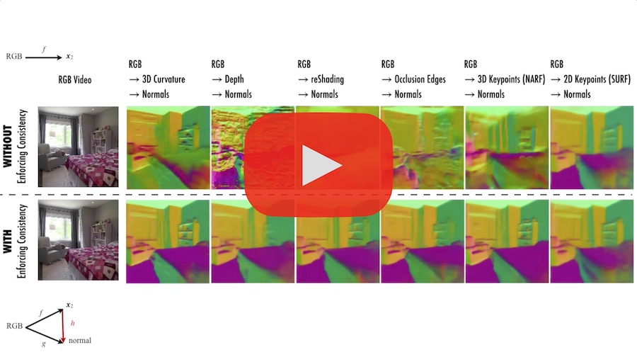
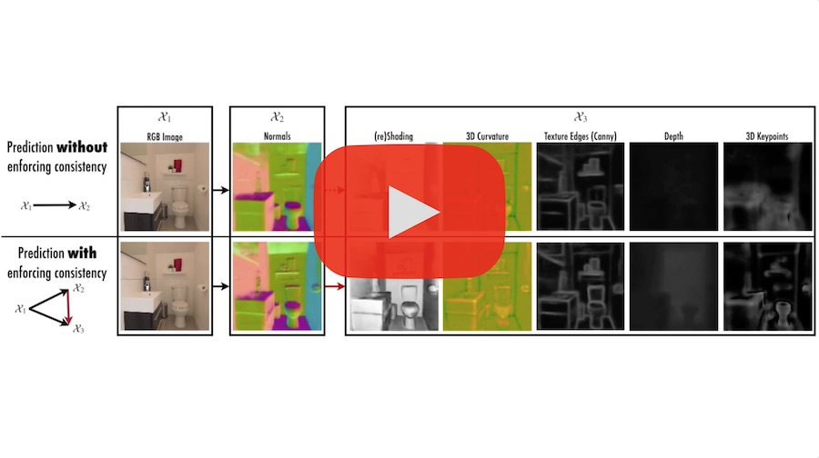

# Robust Learning Through Cross-Task Consistency: Code
## CVPR 2020: Paper 7888

See the following supplementary video showing results from different stages of the proposed algorithm and multiple baselines:

See the following video for extended results:

